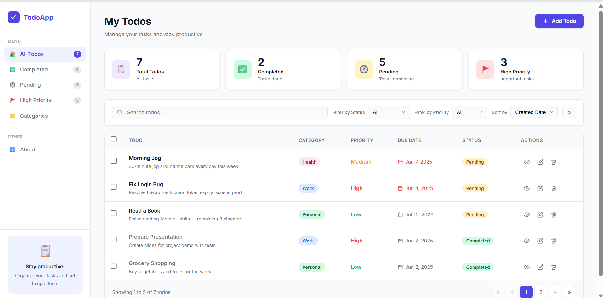
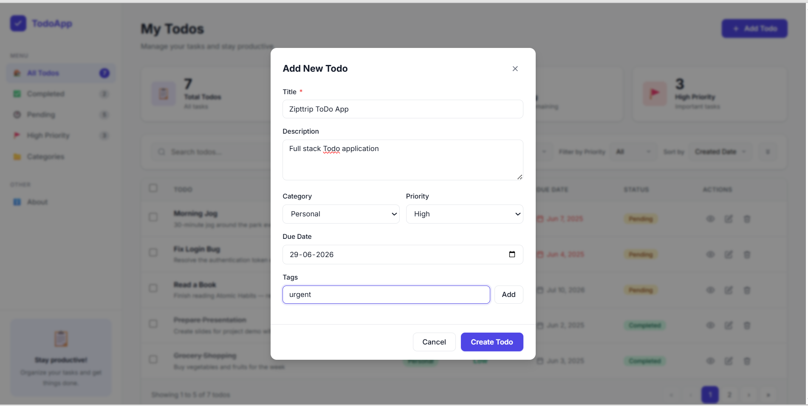
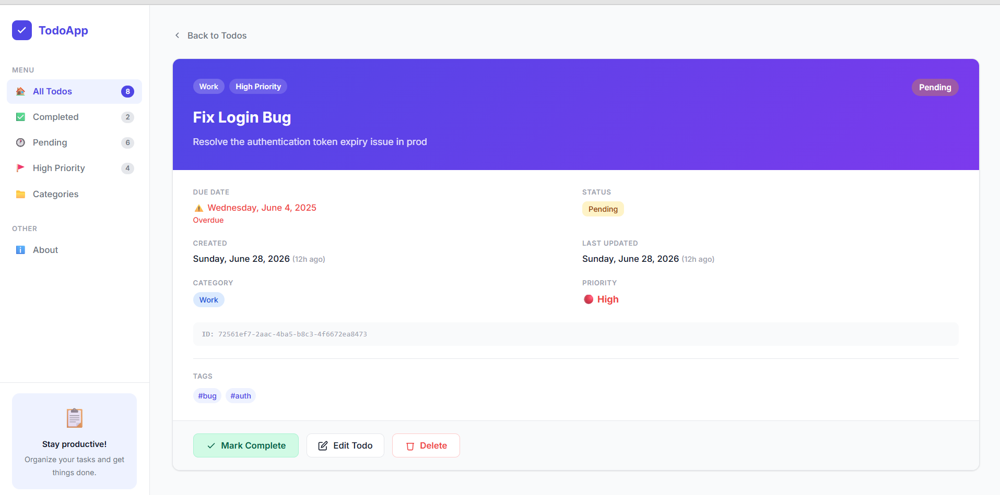
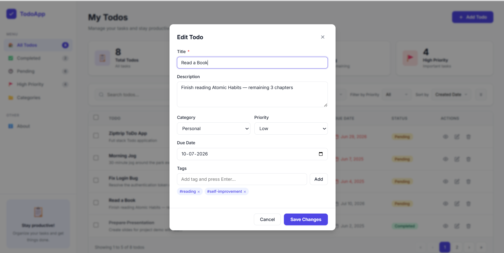
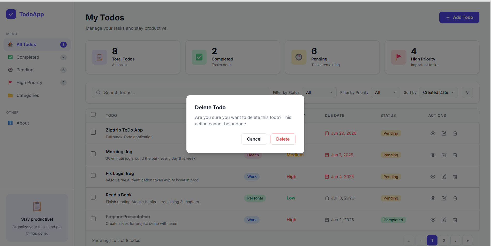
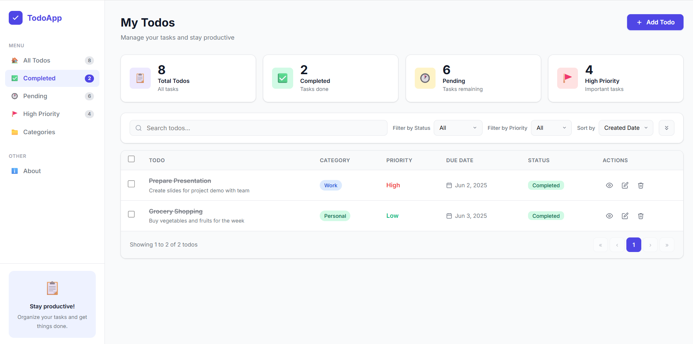
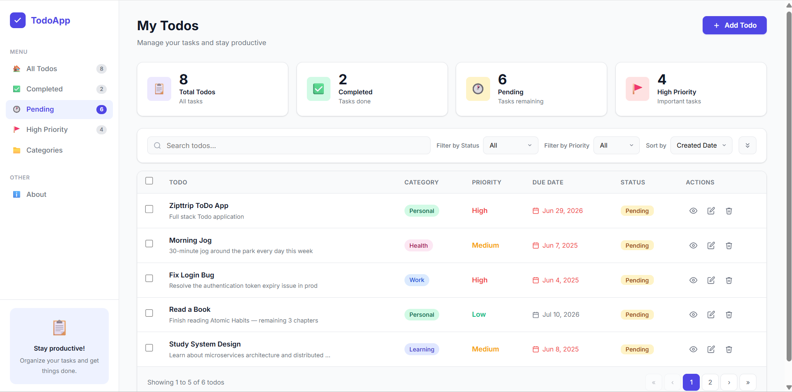
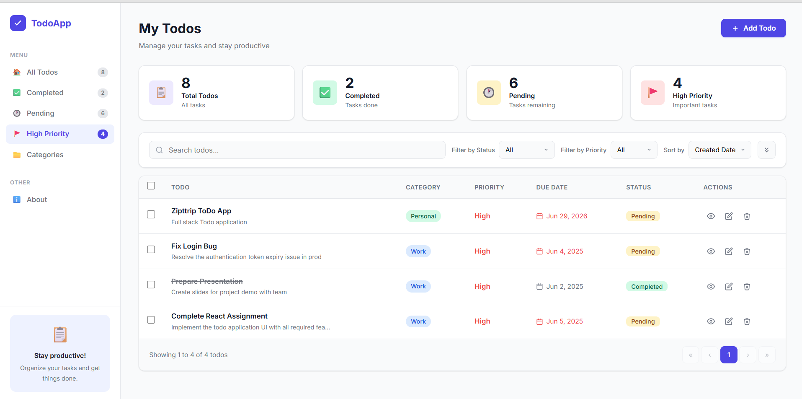

# TodoApp — Full Stack Todo Application

A complete, production-quality todo management application built with **React** (frontend) and **Node.js + Express** (backend), matching the provided design specification.

---

## Project Structure

```
todo-app/
├── backend/          # Express.js REST API
│   ├── server.js     # Main server + all routes
│   ├── data/         # JSON file database (auto-created)
│   └── package.json
├── frontend/         # React multi-page application
│   ├── src/
│   │   ├── App.js              # Root app + hash-based router
│   │   ├── api/todos.js        # API client helpers
│   │   ├── components/
│   │   │   ├── Sidebar.js      # Navigation sidebar
│   │   │   ├── TodoModal.js    # Add / Edit modal form
│   │   │   ├── Confirm.js      # Delete confirmation dialog
│   │   │   └── Toast.js        # Toast notifications
│   │   └── pages/
│   │       ├── TodoList.js     # Main todos list page
│   │       └── TodoDetail.js   # Single todo detail page
│   └── package.json
├── README.md
└── FEATURES.md
```

---

##  Quick Start

### 1. Backend

```bash
cd backend
npm install
npm start          # runs on http://localhost:5000
# or: npm run dev  # with auto-reload (nodemon)
```

### 2. Frontend

```bash
cd frontend
npm install
npm start          # runs on http://localhost:3000
```

Open **http://localhost:3000** in your browser.

> The frontend proxies `/api` requests to `localhost:5000` automatically via the `"proxy"` field in `package.json`.

---

## Tech Stack

| Layer     | Technology              |
|-----------|-------------------------|
| Frontend  | React 18, CSS Variables |
| Backend   | Node.js, Express 4      |
| Database  | JSON file (`data/todos.json`) |
| Routing   | Hash-based (`#/`, `#/todo/:id`) |
| HTTP      | Native `fetch` API      |

---


## Documentation

- [FEATURES.md](FEATURES.md) — Complete feature documentation.
- [API.md](API.md) — REST API documentation.

---
##  Application Screenshots

### Dashboard


### Todo Details


### View Todo


### Edit Todo


### Delete Todo


### Completed Tasks


### Pending Tasks


### High Priority Tasks


## Author
**Pavithra**  
VIT Student  
Built for Ziptripp selection process assignment.
